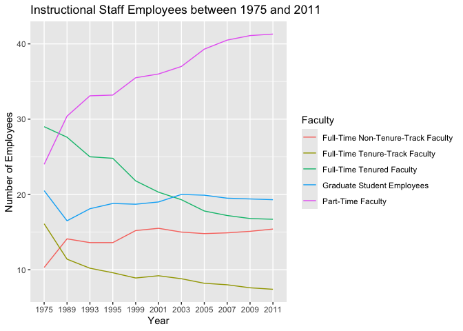
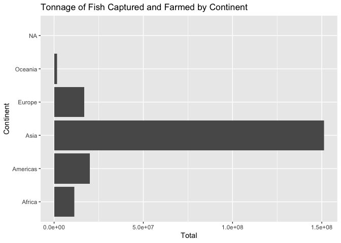

Lab 06 - Ugly charts and Simpson’s paradox
================
Tiffani J. Hill
February 18, 2025

### Load packages and data

``` r
library(tidyverse) 
library(dsbox)
library(mosaicData) 
library(countrycode)
```

``` r
library(usethis)
use_git_config(
  user.name = "Tiffani Hill",
  user.email = "hillt24@wfu.edu"
)
```

``` r
staff <- read_csv("data/instructional-staff.csv")
```

    ## Rows: 5 Columns: 12
    ## ── Column specification ────────────────────────────────────────────────────────
    ## Delimiter: ","
    ## chr  (1): faculty_type
    ## dbl (11): 1975, 1989, 1993, 1995, 1999, 2001, 2003, 2005, 2007, 2009, 2011
    ## 
    ## ℹ Use `spec()` to retrieve the full column specification for this data.
    ## ℹ Specify the column types or set `show_col_types = FALSE` to quiet this message.

There should be 55 rows of data.

``` r
staff_long <- staff %>% 
  pivot_longer(cols = -faculty_type, names_to = "year") %>% 
  mutate(value = as.numeric(value))
```

``` r
staff_long %>% 
  ggplot(aes(x = year, 
             y = value, 
             color = faculty_type)) +
  geom_line()
```

    ## `geom_line()`: Each group consists of only one observation.
    ## ℹ Do you need to adjust the group aesthetic?

<!-- -->

``` r
staff_long %>% 
  ggplot(aes(
    x = year,
    y = value,
    group = faculty_type,
    color = faculty_type 
  )) +
  geom_line() +
  labs(
    title = "Instructional Staff Employees between 1975 and 2011",
    x = "Year",
    y = "Number of Employees",
   color = "Faculty"
    
    
  )
```

<!-- --> \###
Exercise 1 I think this graph is pretty sufficient, however, I would
change the colors so that all full time employees are one color.

### Exercise 2

``` r
fisheries <- read_csv("data/fisheries.csv")
```

    ## Rows: 216 Columns: 4
    ## ── Column specification ────────────────────────────────────────────────────────
    ## Delimiter: ","
    ## chr (1): country
    ## dbl (3): capture, aquaculture, total
    ## 
    ## ℹ Use `spec()` to retrieve the full column specification for this data.
    ## ℹ Specify the column types or set `show_col_types = FALSE` to quiet this message.

### Exercise 3

At the very least, we need to make it so that other countries data is
visible because we can only see two colors. This is very hard
considering that there are so many countries included. I decided to
create a variable for continent and use the continents on the x axis
instead of the country. An alternative would also be to make separate
graphs with subsets of the data. Note: I wasn’t sure how to delete the
NA column.

``` r
fisheries <- fisheries %>% 
  mutate(continent = countrycode(country,
                                  origin = "country.name",
                                  destination = "continent"))
```

    ## Warning: There were 2 warnings in `mutate()`.
    ## The first warning was:
    ## ℹ In argument: `continent = countrycode(country, origin = "country.name",
    ##   destination = "continent")`.
    ## Caused by warning:
    ## ! Some values were not matched unambiguously: Jersey and Guernsey
    ## ℹ Run `dplyr::last_dplyr_warnings()` to see the 1 remaining warning.

``` r
fisheries %>% 
  group_by(continent) %>% 
  ggplot(aes(x = continent, y = total))+
  geom_col() +
  coord_flip() +
  labs(
    title = "Tonnage of Fish Captured and Farmed by Continent",
    x = "Continent",
    y = "Total"
  )
```

<!-- -->

``` r
  theme_minimal()
```

    ## <theme> List of 144
    ##  $ line                            : <ggplot2::element_line>
    ##   ..@ colour       : chr "black"
    ##   ..@ linewidth    : num 0.5
    ##   ..@ linetype     : num 1
    ##   ..@ lineend      : chr "butt"
    ##   ..@ linejoin     : chr "round"
    ##   ..@ arrow        : logi FALSE
    ##   ..@ arrow.fill   : chr "black"
    ##   ..@ inherit.blank: logi TRUE
    ##  $ rect                            : <ggplot2::element_rect>
    ##   ..@ fill         : chr "white"
    ##   ..@ colour       : chr "black"
    ##   ..@ linewidth    : num 0.5
    ##   ..@ linetype     : num 1
    ##   ..@ linejoin     : chr "round"
    ##   ..@ inherit.blank: logi TRUE
    ##  $ text                            : <ggplot2::element_text>
    ##   ..@ family       : chr ""
    ##   ..@ face         : chr "plain"
    ##   ..@ italic       : chr NA
    ##   ..@ fontweight   : num NA
    ##   ..@ fontwidth    : num NA
    ##   ..@ colour       : chr "black"
    ##   ..@ size         : num 11
    ##   ..@ hjust        : num 0.5
    ##   ..@ vjust        : num 0.5
    ##   ..@ angle        : num 0
    ##   ..@ lineheight   : num 0.9
    ##   ..@ margin       : <ggplot2::margin> num [1:4] 0 0 0 0
    ##   ..@ debug        : logi FALSE
    ##   ..@ inherit.blank: logi TRUE
    ##  $ title                           : <ggplot2::element_text>
    ##   ..@ family       : NULL
    ##   ..@ face         : NULL
    ##   ..@ italic       : chr NA
    ##   ..@ fontweight   : num NA
    ##   ..@ fontwidth    : num NA
    ##   ..@ colour       : NULL
    ##   ..@ size         : NULL
    ##   ..@ hjust        : NULL
    ##   ..@ vjust        : NULL
    ##   ..@ angle        : NULL
    ##   ..@ lineheight   : NULL
    ##   ..@ margin       : NULL
    ##   ..@ debug        : NULL
    ##   ..@ inherit.blank: logi TRUE
    ##  $ point                           : <ggplot2::element_point>
    ##   ..@ colour       : chr "black"
    ##   ..@ shape        : num 19
    ##   ..@ size         : num 1.5
    ##   ..@ fill         : chr "white"
    ##   ..@ stroke       : num 0.5
    ##   ..@ inherit.blank: logi TRUE
    ##  $ polygon                         : <ggplot2::element_polygon>
    ##   ..@ fill         : chr "white"
    ##   ..@ colour       : chr "black"
    ##   ..@ linewidth    : num 0.5
    ##   ..@ linetype     : num 1
    ##   ..@ linejoin     : chr "round"
    ##   ..@ inherit.blank: logi TRUE
    ##  $ geom                            : <ggplot2::element_geom>
    ##   ..@ ink        : chr "black"
    ##   ..@ paper      : chr "white"
    ##   ..@ accent     : chr "#3366FF"
    ##   ..@ linewidth  : num 0.5
    ##   ..@ borderwidth: num 0.5
    ##   ..@ linetype   : int 1
    ##   ..@ bordertype : int 1
    ##   ..@ family     : chr ""
    ##   ..@ fontsize   : num 3.87
    ##   ..@ pointsize  : num 1.5
    ##   ..@ pointshape : num 19
    ##   ..@ colour     : NULL
    ##   ..@ fill       : NULL
    ##  $ spacing                         : 'simpleUnit' num 5.5points
    ##   ..- attr(*, "unit")= int 8
    ##  $ margins                         : <ggplot2::margin> num [1:4] 5.5 5.5 5.5 5.5
    ##  $ aspect.ratio                    : NULL
    ##  $ axis.title                      : NULL
    ##  $ axis.title.x                    : <ggplot2::element_text>
    ##   ..@ family       : NULL
    ##   ..@ face         : NULL
    ##   ..@ italic       : chr NA
    ##   ..@ fontweight   : num NA
    ##   ..@ fontwidth    : num NA
    ##   ..@ colour       : NULL
    ##   ..@ size         : NULL
    ##   ..@ hjust        : NULL
    ##   ..@ vjust        : num 1
    ##   ..@ angle        : NULL
    ##   ..@ lineheight   : NULL
    ##   ..@ margin       : <ggplot2::margin> num [1:4] 2.75 0 0 0
    ##   ..@ debug        : NULL
    ##   ..@ inherit.blank: logi TRUE
    ##  $ axis.title.x.top                : <ggplot2::element_text>
    ##   ..@ family       : NULL
    ##   ..@ face         : NULL
    ##   ..@ italic       : chr NA
    ##   ..@ fontweight   : num NA
    ##   ..@ fontwidth    : num NA
    ##   ..@ colour       : NULL
    ##   ..@ size         : NULL
    ##   ..@ hjust        : NULL
    ##   ..@ vjust        : num 0
    ##   ..@ angle        : NULL
    ##   ..@ lineheight   : NULL
    ##   ..@ margin       : <ggplot2::margin> num [1:4] 0 0 2.75 0
    ##   ..@ debug        : NULL
    ##   ..@ inherit.blank: logi TRUE
    ##  $ axis.title.x.bottom             : NULL
    ##  $ axis.title.y                    : <ggplot2::element_text>
    ##   ..@ family       : NULL
    ##   ..@ face         : NULL
    ##   ..@ italic       : chr NA
    ##   ..@ fontweight   : num NA
    ##   ..@ fontwidth    : num NA
    ##   ..@ colour       : NULL
    ##   ..@ size         : NULL
    ##   ..@ hjust        : NULL
    ##   ..@ vjust        : num 1
    ##   ..@ angle        : num 90
    ##   ..@ lineheight   : NULL
    ##   ..@ margin       : <ggplot2::margin> num [1:4] 0 2.75 0 0
    ##   ..@ debug        : NULL
    ##   ..@ inherit.blank: logi TRUE
    ##  $ axis.title.y.left               : NULL
    ##  $ axis.title.y.right              : <ggplot2::element_text>
    ##   ..@ family       : NULL
    ##   ..@ face         : NULL
    ##   ..@ italic       : chr NA
    ##   ..@ fontweight   : num NA
    ##   ..@ fontwidth    : num NA
    ##   ..@ colour       : NULL
    ##   ..@ size         : NULL
    ##   ..@ hjust        : NULL
    ##   ..@ vjust        : num 1
    ##   ..@ angle        : num -90
    ##   ..@ lineheight   : NULL
    ##   ..@ margin       : <ggplot2::margin> num [1:4] 0 0 0 2.75
    ##   ..@ debug        : NULL
    ##   ..@ inherit.blank: logi TRUE
    ##  $ axis.text                       : <ggplot2::element_text>
    ##   ..@ family       : NULL
    ##   ..@ face         : NULL
    ##   ..@ italic       : chr NA
    ##   ..@ fontweight   : num NA
    ##   ..@ fontwidth    : num NA
    ##   ..@ colour       : chr "#4D4D4DFF"
    ##   ..@ size         : 'rel' num 0.8
    ##   ..@ hjust        : NULL
    ##   ..@ vjust        : NULL
    ##   ..@ angle        : NULL
    ##   ..@ lineheight   : NULL
    ##   ..@ margin       : NULL
    ##   ..@ debug        : NULL
    ##   ..@ inherit.blank: logi TRUE
    ##  $ axis.text.x                     : <ggplot2::element_text>
    ##   ..@ family       : NULL
    ##   ..@ face         : NULL
    ##   ..@ italic       : chr NA
    ##   ..@ fontweight   : num NA
    ##   ..@ fontwidth    : num NA
    ##   ..@ colour       : NULL
    ##   ..@ size         : NULL
    ##   ..@ hjust        : NULL
    ##   ..@ vjust        : num 1
    ##   ..@ angle        : NULL
    ##   ..@ lineheight   : NULL
    ##   ..@ margin       : <ggplot2::margin> num [1:4] 2.2 0 0 0
    ##   ..@ debug        : NULL
    ##   ..@ inherit.blank: logi TRUE
    ##  $ axis.text.x.top                 : <ggplot2::element_text>
    ##   ..@ family       : NULL
    ##   ..@ face         : NULL
    ##   ..@ italic       : chr NA
    ##   ..@ fontweight   : num NA
    ##   ..@ fontwidth    : num NA
    ##   ..@ colour       : NULL
    ##   ..@ size         : NULL
    ##   ..@ hjust        : NULL
    ##   ..@ vjust        : NULL
    ##   ..@ angle        : NULL
    ##   ..@ lineheight   : NULL
    ##   ..@ margin       : <ggplot2::margin> num [1:4] 0 0 4.95 0
    ##   ..@ debug        : NULL
    ##   ..@ inherit.blank: logi TRUE
    ##  $ axis.text.x.bottom              : <ggplot2::element_text>
    ##   ..@ family       : NULL
    ##   ..@ face         : NULL
    ##   ..@ italic       : chr NA
    ##   ..@ fontweight   : num NA
    ##   ..@ fontwidth    : num NA
    ##   ..@ colour       : NULL
    ##   ..@ size         : NULL
    ##   ..@ hjust        : NULL
    ##   ..@ vjust        : NULL
    ##   ..@ angle        : NULL
    ##   ..@ lineheight   : NULL
    ##   ..@ margin       : <ggplot2::margin> num [1:4] 4.95 0 0 0
    ##   ..@ debug        : NULL
    ##   ..@ inherit.blank: logi TRUE
    ##  $ axis.text.y                     : <ggplot2::element_text>
    ##   ..@ family       : NULL
    ##   ..@ face         : NULL
    ##   ..@ italic       : chr NA
    ##   ..@ fontweight   : num NA
    ##   ..@ fontwidth    : num NA
    ##   ..@ colour       : NULL
    ##   ..@ size         : NULL
    ##   ..@ hjust        : num 1
    ##   ..@ vjust        : NULL
    ##   ..@ angle        : NULL
    ##   ..@ lineheight   : NULL
    ##   ..@ margin       : <ggplot2::margin> num [1:4] 0 2.2 0 0
    ##   ..@ debug        : NULL
    ##   ..@ inherit.blank: logi TRUE
    ##  $ axis.text.y.left                : <ggplot2::element_text>
    ##   ..@ family       : NULL
    ##   ..@ face         : NULL
    ##   ..@ italic       : chr NA
    ##   ..@ fontweight   : num NA
    ##   ..@ fontwidth    : num NA
    ##   ..@ colour       : NULL
    ##   ..@ size         : NULL
    ##   ..@ hjust        : NULL
    ##   ..@ vjust        : NULL
    ##   ..@ angle        : NULL
    ##   ..@ lineheight   : NULL
    ##   ..@ margin       : <ggplot2::margin> num [1:4] 0 4.95 0 0
    ##   ..@ debug        : NULL
    ##   ..@ inherit.blank: logi TRUE
    ##  $ axis.text.y.right               : <ggplot2::element_text>
    ##   ..@ family       : NULL
    ##   ..@ face         : NULL
    ##   ..@ italic       : chr NA
    ##   ..@ fontweight   : num NA
    ##   ..@ fontwidth    : num NA
    ##   ..@ colour       : NULL
    ##   ..@ size         : NULL
    ##   ..@ hjust        : NULL
    ##   ..@ vjust        : NULL
    ##   ..@ angle        : NULL
    ##   ..@ lineheight   : NULL
    ##   ..@ margin       : <ggplot2::margin> num [1:4] 0 0 0 4.95
    ##   ..@ debug        : NULL
    ##   ..@ inherit.blank: logi TRUE
    ##  $ axis.text.theta                 : NULL
    ##  $ axis.text.r                     : <ggplot2::element_text>
    ##   ..@ family       : NULL
    ##   ..@ face         : NULL
    ##   ..@ italic       : chr NA
    ##   ..@ fontweight   : num NA
    ##   ..@ fontwidth    : num NA
    ##   ..@ colour       : NULL
    ##   ..@ size         : NULL
    ##   ..@ hjust        : num 0.5
    ##   ..@ vjust        : NULL
    ##   ..@ angle        : NULL
    ##   ..@ lineheight   : NULL
    ##   ..@ margin       : <ggplot2::margin> num [1:4] 0 2.2 0 2.2
    ##   ..@ debug        : NULL
    ##   ..@ inherit.blank: logi TRUE
    ##  $ axis.ticks                      : <ggplot2::element_blank>
    ##  $ axis.ticks.x                    : NULL
    ##  $ axis.ticks.x.top                : NULL
    ##  $ axis.ticks.x.bottom             : NULL
    ##  $ axis.ticks.y                    : NULL
    ##  $ axis.ticks.y.left               : NULL
    ##  $ axis.ticks.y.right              : NULL
    ##  $ axis.ticks.theta                : NULL
    ##  $ axis.ticks.r                    : NULL
    ##  $ axis.minor.ticks.x.top          : NULL
    ##  $ axis.minor.ticks.x.bottom       : NULL
    ##  $ axis.minor.ticks.y.left         : NULL
    ##  $ axis.minor.ticks.y.right        : NULL
    ##  $ axis.minor.ticks.theta          : NULL
    ##  $ axis.minor.ticks.r              : NULL
    ##  $ axis.ticks.length               : 'rel' num 0.5
    ##  $ axis.ticks.length.x             : NULL
    ##  $ axis.ticks.length.x.top         : NULL
    ##  $ axis.ticks.length.x.bottom      : NULL
    ##  $ axis.ticks.length.y             : NULL
    ##  $ axis.ticks.length.y.left        : NULL
    ##  $ axis.ticks.length.y.right       : NULL
    ##  $ axis.ticks.length.theta         : NULL
    ##  $ axis.ticks.length.r             : NULL
    ##  $ axis.minor.ticks.length         : 'rel' num 0.75
    ##  $ axis.minor.ticks.length.x       : NULL
    ##  $ axis.minor.ticks.length.x.top   : NULL
    ##  $ axis.minor.ticks.length.x.bottom: NULL
    ##  $ axis.minor.ticks.length.y       : NULL
    ##  $ axis.minor.ticks.length.y.left  : NULL
    ##  $ axis.minor.ticks.length.y.right : NULL
    ##  $ axis.minor.ticks.length.theta   : NULL
    ##  $ axis.minor.ticks.length.r       : NULL
    ##  $ axis.line                       : <ggplot2::element_blank>
    ##  $ axis.line.x                     : NULL
    ##  $ axis.line.x.top                 : NULL
    ##  $ axis.line.x.bottom              : NULL
    ##  $ axis.line.y                     : NULL
    ##  $ axis.line.y.left                : NULL
    ##  $ axis.line.y.right               : NULL
    ##  $ axis.line.theta                 : NULL
    ##  $ axis.line.r                     : NULL
    ##  $ legend.background               : <ggplot2::element_blank>
    ##  $ legend.margin                   : NULL
    ##  $ legend.spacing                  : 'rel' num 2
    ##  $ legend.spacing.x                : NULL
    ##  $ legend.spacing.y                : NULL
    ##  $ legend.key                      : <ggplot2::element_blank>
    ##  $ legend.key.size                 : 'simpleUnit' num 1.2lines
    ##   ..- attr(*, "unit")= int 3
    ##  $ legend.key.height               : NULL
    ##  $ legend.key.width                : NULL
    ##  $ legend.key.spacing              : NULL
    ##  $ legend.key.spacing.x            : NULL
    ##  $ legend.key.spacing.y            : NULL
    ##  $ legend.key.justification        : NULL
    ##  $ legend.frame                    : NULL
    ##  $ legend.ticks                    : NULL
    ##  $ legend.ticks.length             : 'rel' num 0.2
    ##  $ legend.axis.line                : NULL
    ##  $ legend.text                     : <ggplot2::element_text>
    ##   ..@ family       : NULL
    ##   ..@ face         : NULL
    ##   ..@ italic       : chr NA
    ##   ..@ fontweight   : num NA
    ##   ..@ fontwidth    : num NA
    ##   ..@ colour       : NULL
    ##   ..@ size         : 'rel' num 0.8
    ##   ..@ hjust        : NULL
    ##   ..@ vjust        : NULL
    ##   ..@ angle        : NULL
    ##   ..@ lineheight   : NULL
    ##   ..@ margin       : NULL
    ##   ..@ debug        : NULL
    ##   ..@ inherit.blank: logi TRUE
    ##  $ legend.text.position            : NULL
    ##  $ legend.title                    : <ggplot2::element_text>
    ##   ..@ family       : NULL
    ##   ..@ face         : NULL
    ##   ..@ italic       : chr NA
    ##   ..@ fontweight   : num NA
    ##   ..@ fontwidth    : num NA
    ##   ..@ colour       : NULL
    ##   ..@ size         : NULL
    ##   ..@ hjust        : num 0
    ##   ..@ vjust        : NULL
    ##   ..@ angle        : NULL
    ##   ..@ lineheight   : NULL
    ##   ..@ margin       : NULL
    ##   ..@ debug        : NULL
    ##   ..@ inherit.blank: logi TRUE
    ##  $ legend.title.position           : NULL
    ##  $ legend.position                 : chr "right"
    ##  $ legend.position.inside          : NULL
    ##  $ legend.direction                : NULL
    ##  $ legend.byrow                    : NULL
    ##  $ legend.justification            : chr "center"
    ##  $ legend.justification.top        : NULL
    ##  $ legend.justification.bottom     : NULL
    ##  $ legend.justification.left       : NULL
    ##  $ legend.justification.right      : NULL
    ##  $ legend.justification.inside     : NULL
    ##   [list output truncated]
    ##  @ complete: logi TRUE
    ##  @ validate: logi TRUE

Add exercise headings as needed. \##Stretch Goals I really wanted to do
the stretch goals but the performance package won’t load.

``` r
library(tidyverse)
library(mosaicData)
```

``` r
data("Whickham")
```

``` r
?Whickham
library(performance)
performance::compare_performance() # might not be behaving as intented.
```
